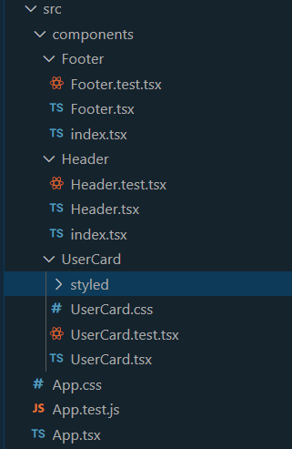
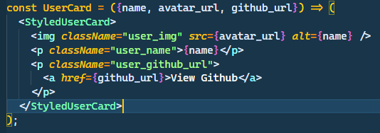
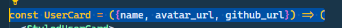

# React Code Standards

### As developers, we run into lot of known issues as we scale up over codebase. Here are some coding standards which can make your code organized and helps you better read and execute your code.

<br >
<br >

- Naming Conventions
- Folder Structure
- Writing Clean Code
- Writing Tests
- Linters and Code Styling
- Styles

## `Naming Conventions`

- It's always a good practice to use Pascal Case to name the components.

```
    Header.tsx
```

- User camel case for naming the helper and utility functions.

```
    transformUrl.ts
```

- Test files should be named as the file/component it covers.

```
    Header.tsx -> Header.test.tsx
```

- Variable names should also follow camel casing

```
    const companyName = 'Techigai'
```

## `Folder Structure`



- Include any component in a folder of it's own and add the respective test and style files in the same directory with the same name as component.

```
    /Header/Header.tsx
    /Header/Header.css
    /Header/Header.test.tsx
    /Header/index.tsx
```

- Export the component from the `index.tsx`

## `Writing Clean Code`

- Avoid code repetition, instead write utility functions to reuse the code.
- Only write a single component in a file.
- Use Stateful and Presentational Components which helps the separation of concerns and helps reusability.



- Use fragments <>…</> instead of divs. Which saves rendering another div to the DOM.

- Use Template literals over the string concatenations.

```
    'Welcome ' + user + '!!' //Avoid

    `Welcome ${user}!!`  //Good
```

- Write comments about why you did something instead how the code works, make the code self-explanatory.

- Use ES6 Syntax wherever possible.

  - Destructuring the props. 
  - Prefer using **const** over **let** and **var**. Use **const** for the variables which won’t change and let indicates the value of the variable that can be changed.
  - Prefer Arrow functions for more clean code as they allow simplifying the code to a single line.

- Prefer Functional Components and Hooks instead of class components.

## `Writing Tests`

- Ensure every component in the code base is covered with tests which helps in ensuring the code quality and avoids running into edge cases while refactoring the code.

- Define a Quality Gate so that the builds or commits can happen only after reaching certain percentage of code coverage.

- Mock the API and database calls while writing tests.

- Do not include any logic inside the test file.

## `Linting and Code Styling`

- Use eslint through the codebase which enforces the best practices through out the code editor.

- Use Prettier for auto code styling.

- Using pre-commit hooks like Husky will ensure quality code is committed.

## `Styling`

- Use styled components to avoid conflicts between the same class names. (Optional)
